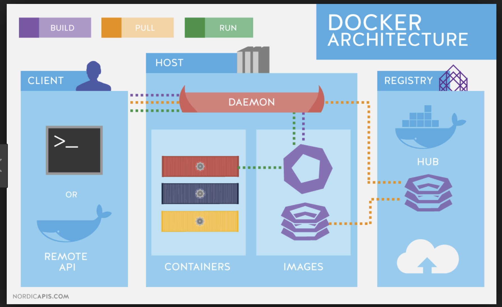
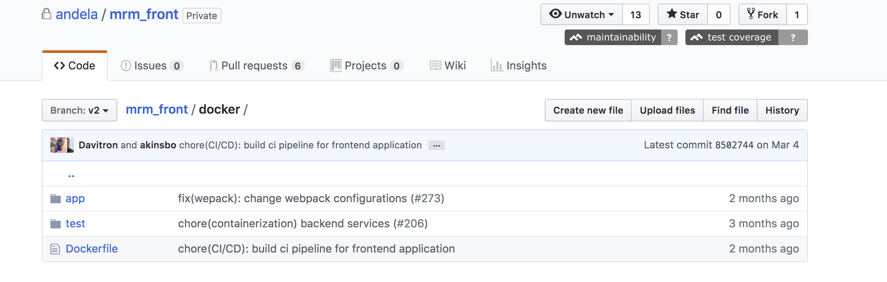

HOW CONTAINERS WORK WITH THE APPLICATION
============
Container Basics
-------------
An application container is a stand-alone package for a software application that comprises of application binaries, software dependencies and the hardware requirements needed to run the application in a single unit

Why Containers
-------------
* The container works as a self isolated unit that can run anywhere that supports it
* The container retains it's identity regardless of the operating system it is running on. This helps ensure that the container will run on different servers.
* Containers implement micro service architecture, where each microservice comprises of a number of containers, both master and slave.This makes application deployment easy by the engineering teams.

Docker as a containerization tool for the Converge Application
------------
Docker is one of the most widely used containerization technologies because it is open source and works across a number of platforms.
Converge as an application that manages meeting rooms for Andela Uganda was containerized using Docker which helps consume fewer resources than a comparable deployment on virtual machines because containers share resources without a full operating system to underpin each app.
Converge comprises of the frontend service, backend service and mobile service. All these were containerized using Docker in order to reap from the benefits of Docker
--------  -----------------------
The Docker Architecture
--------  -----------------------

The Docker architecture uses a client-server model and comprises of the Docker Client, Docker Host, Network and Storage components, and the Docker Registry/Hub. 

The Docker Client
-----------------
The Docker client enables users to interact with Docker. The docker client is used in the terminal to interact with the Converge application.
The docker client allows the user to run commands such as:
* docker build
* docker pull
* docker run
* docker create
* docker stop

The DockerHost
------------------
The Docker host provides a complete environment to execute and run applications. It comprises of the Docker daemon, Images, Containers, Networks, and Storage.
The daemon is responsible for all container-related actions and receives commands via the CLI or the REST API. 

How the Docker Daemon is used in Converge
When a user types `docker run command` to start up the container from the converge docker image, the docker client  translates that command into http API call, sends it to docker daemon which then evaluates the request, talks to underlying operating system and provisions the container.

Secondly, the Docker daemon pulls and builds container images as requested by the docker client. Once the image is pulled, a working model for the container is built through  using a set of instructions callled the build file.

Docker Images
The docker image is created from the Converge Docker files which are shown in the screenshots below:
--------  -----------------------
The Front End
--------  -----------------------

The Docker file

--------  -----------------------
--------  -----------------------
The Back End
--------  -----------------------

The Docker file

--------  -----------------------
--------  -----------------------
The Mobile Application
--------  -----------------------

The Docker file

--------  -----------------------

A user runs the `docker build command` using the docker client to generate an image from the docker file.
The created image can still be viewed by running `docker images` in the docker client
The docker image is an inert, immutable, file that's essentially a snapshot of a container created with the build command, and produces a container once started.

The Docker Registry
-------------------
Once the image is created, it is stored in a Docker registry such as `registry.hub.docker.com` `and gcr.io`
The registry is an open source and highly scalable server side application that stores and lets one distribute docker images.

