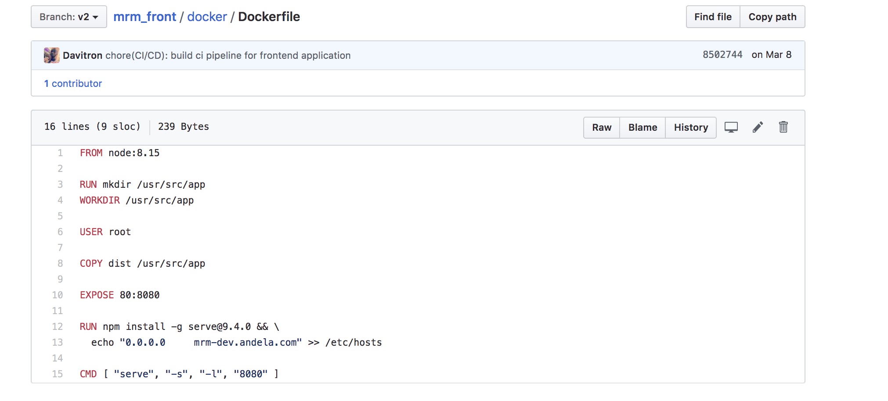

HOW CONTAINERS WORK WITH THE APPLICATION
============
Container Basics
-------------
An application container is a stand-alone package for a software application that comprises of application binaries, software dependencies and the hardware requirements needed to run the application in a single unit

Why Containers
-------------
* The container works as a self isolated unit that can run anywhere that supports it
* The container retains it's identity regardless of the operating system it is running on. This helps ensure that the container will run on different servers.
* Containers implement micro service architecture, where each microservice comprises of a number of containers, both master and slave.This makes application deployment easy by the engineering teams.

Docker as a containerization tool for the Converge Application
------------
Docker is one of the most widely used containerization technologies because it is open source and works across a number of platforms.
Converge as an application that manages meeting rooms for Andela Uganda was containerized using Docker which helps consume fewer resources than a comparable deployment on virtual machines because containers share resources without a full operating system to underpin each app.
Converge comprises of the frontend service, backend service and mobile service. All these were containerized using Docker in order to reap from the benefits of Docker

The following screenshots illustrate the use of Docker within the three Converge applications
--------  -----------------------
The Front End
--------  -----------------------

The Docker file

--------  -----------------------
--------  -----------------------
The Back End
--------  -----------------------

The Docker file

--------  -----------------------
--------  -----------------------
The Mobile Application
--------  -----------------------

The Docker file

--------  -----------------------
--------  -----------------------
How the Containers work
--------  -----------------------

The Docker architecture uses a client-server model and comprises of the Docker Client, Docker Host, Network and Storage components, and the Docker Registry/Hub. 

The Docker Client
-----------------
The Docker client enables users to interact with Docker. The Docker client can reside on the same host as the daemon or connect to a daemon on a remote host. A docker client can communicate with more than one daemon. The Docker client provides a command line interface (CLI) that allows you to issue build, run, and stop application commands to a Docker daemon.

The main purpose of the Docker Client is to provide a means to direct the pull of images from a registry and to have it run on a Docker host. Common commands issued by a client are:

* docker build
* docker pull
* docker run

The DockerHost
------------------
The Docker host provides a complete environment to execute and run applications. It comprises of the Docker daemon, Images, Containers, Networks, and Storage. As previously mentioned, the daemon is responsible for all container-related actions and receives commands via the CLI or the REST API. It can also communicate with other daemons to manage its services. The Docker daemon pulls and builds container images as requested by the client. Once it pulls a requested image, it builds a working model for the container by utilizing a set of instructions known as a build file. The build file can also include instructions for the daemon to pre-load other components prior to running the container, or instructions to be sent to the local command line once the container is built.

Docker Objects
Various objects are used in the assembling of your application. The main requisite Docker objects are:

Images
Images are a read-only binary template used to build containers. Images also contain metadata that describe the container's capabilities and needs. Images are used to store and ship applications. An image can be used on its own to build a container or customized to add additional elements to extend the current configuration. Container images can be shared across teams within an enterprise using a private container registry, or shared with the world using a public registry like Docker Hub. Images are a core part of the Docker experience as they enable collaboration between developers in a way that was not possible before.

Containers
Containers are encapsulated environments in which you run applications. The container is defined by the image and any additional configuration options provided on starting the container, including and not limited to the network connections and storage options. Containers only have access to resources that are defined in the image, unless additional access is defined when building the image into a container. You can also create a new image based on the current state of a container. Since containers are much smaller than VMs, they can be spun up in a matter of seconds, and result in much better server density.

Networking
Docker implements networking in an application-driven manner and provides various options while maintaining enough abstraction for application developers. There are basically two types of networks available - the default Docker network and user-defined networks. By default, you get three different networks on the installation of Docker - none, bridge, and host. The none and host networks are part of the network stack in Docker. The bridge network automatically creates a gateway and IP subnet and all containers that belong to this network can talk to each other via IP addressing. This network is not commonly used as it does not scale well and has constraints in terms of network usability and service discovery.

The other type of networks is user-defined networks. Administrators can configure multiple user-defined networks. There are three types:

Bridge network: Similar to the default bridge network, a user-defined Bridge network differs in that there is no need for port forwarding for containers within the network to communicate with each other. The other difference is that it has full support for automatic network discovery.
Overlay network: An Overlay network is used when you need containers on separate hosts to be able to communicate with each other, as in the case of a distributed network. However, a caveat is that swarm mode must be enabled for a cluster of Docker engines, known as a swarm, to be able to join the same group.
Macvlan network: When using Bridge and Overlay networks a bridge resides between the container and the host. A Macvlan network removes this bridge, providing the benefit of exposing container resources to external networks without dealing with port forwarding. This is realized by using MAC addresses instead of IP addresses.

Storage
You can store data within the writable layer of a container but it requires a storage driver. Being non-persistent, it perishes whenever the container is not running. Moreover, it is not easy to transfer this data. In terms of persistent storage, Docker offers four options:

Data Volumes: Data Volumes provide the ability to create persistent storage, with the ability to rename volumes, list volumes, and also list the container that is associated with the volume. Data Volumes sit on the host file system, outside the containers copy on write mechanism and are fairly efficient.
Data Volume Container: A Data Volume Container is an alternative approach wherein a dedicated container hosts a volume and to mount that volume to other containers. In this case, the volume container is independent of the application container and therefore can be shared across more than one container.
Directory Mounts: Another option is to mount a host’s local directory into a container. In the previously mentioned cases, the volumes would have to be within the Docker volumes folder, whereas when it comes to Directory Mounts any directory on the Host machine can be used as a source for the volume.
Storage Plugins: Storage Plugins provide the ability to connect to external storage platforms. These plugins map storage from the host to an external source like a storage array or an appliance. A list of storage plugins can be found on Docker’s Plugin page.

Storage Plugins
There are storage plugins from various companies to automate the storage provisioning process. For example, 
HPE 3PAR
EMC (ScaleIO, XtremIO, VMAX, Isilon)
NetApp
There are also plugins that support public cloud providers like:

Azure File Storage
Google Compute Platform.
Docker Registries
Docker registries are services that provide locations from where you can store and download images. In other words, a Docker registry contains repositories that host one or more Docker Images. Public Registries include Docker Hub and Docker Cloud and private Registries can also be used. Common commands when working with registries include:

docker push
docker pull
docker run

Service Discovery
Service Discovery allows containers to find out about the environment they are in and find other services offered by other containers.

It is an important factor when trying to build scalable and flexible applications.

The application container is dropped into a system, then runs using the local hardware and operating system. Since it includes all of the necessary dependencies, the container functions exactly the same when deployed on a laptop, on a server, on a virtual machine, in the cloud, or on any other compatible system.
--------  -----------------------

